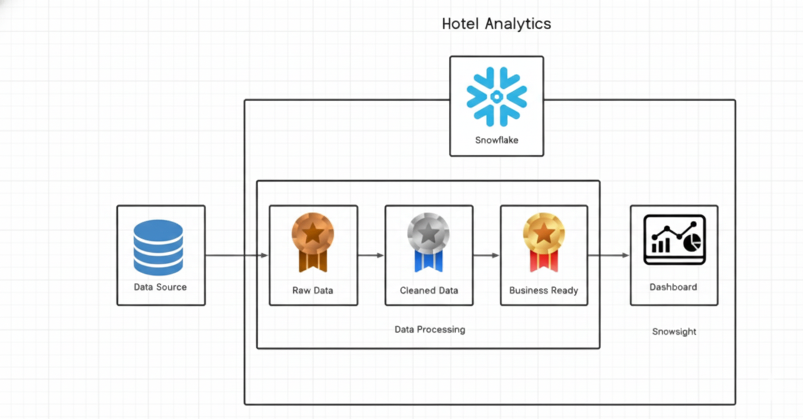

# End-to-End-Hotel-Booking-Data-Engineering-Project-in-Snowflake
Hotel Analytics est un projet d’analyse de données basé sur Snowflake qui transforme des données hôtelières brutes en informations prêtes pour la prise de décision. Il inclut l’ingestion, le nettoyage, la transformation et la visualisation via un dashboard interactif.
# 🏨 Hotel Analytics

**Auteur : Venceslas Osee Ngassam Kate**  
🔗 LinkedIn : https://www.linkedin.com/in/venceslas-osee-ngassam-kate-data-engineer

Hotel Analytics est un projet d’analyse de données basé sur **Snowflake** qui transforme des données hôtelières brutes en informations prêtes pour la prise de décision stratégique.

---

## 📌 Aperçu du projet

L’objectif est de mettre en place un pipeline data complet :
- Ingestion multi-sources
- Stockage dans Snowflake
- Nettoyage & transformation
- Modélisation pour l'analyse
- Visualisation via dashboard

---

## 🏗️ Architecture

Le flux des données suit les couches suivantes :

1. **Data Source**
2. **Raw Data Layer**
3. **Cleaned Data Layer**
4. **Business Ready Layer**
5. **Dashboard Layer (Snowsight)**

Cette structure garantit qualité, traçabilité et performance.

---

## 🛠️ Technologies utilisées

- Snowflake  
- SQL  
- Data Modeling  
- Data Engineering  
- Business Intelligence  
- Cloud Computing  

---

## 📊 Fonctionnalités principales

- Nettoyage & transformation automatique
- Organisation des données par couche
- Création de vues analytiques
- Suivi des indicateurs (KPI) :
  - Taux d’occupation
  - Revenus
  - Comportement client
- Dashboard interactif

---

## 🎯 Objectif métier

Permettre aux hôtels de :
- Mieux comprendre leurs performances
- Optimiser leur stratégie tarifaire
- Améliorer l’expérience client
- Prendre des décisions basées sur les données

---

## 🤝 Contact

📧 Contact via LinkedIn :  
👉 https://www.linkedin.com/in/venceslas-osee-ngassam-kate-data-engineer

Les idées, contributions et retours sont les bienvenus 🚀
